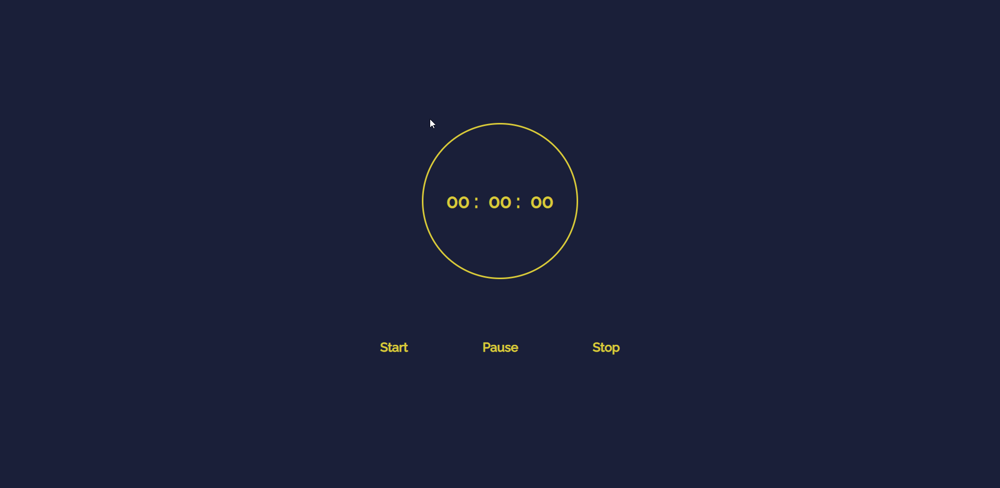

<h1 align="center">
     
    Cronômetro
</h1>

        

<h4 align="center">
    Projeto para apredizado do timeSet e setInterval
</h4>
 

    
     

 

## 🚀 Tecnologias
 

- HTML5
- CSS3
- JavaScript

 

### 📝 Licença
O projeto contém a licença MIT. Para mais informações acesse [LICENSE](https://github.com/tamirysnogueira/Cronometro/blob/master/LICENSE).

 

Feito com 💖 por TamirysNogueira. [Get in Touch!](https://www.linkedin.com/in/tamirys-nogueira-346958205/)